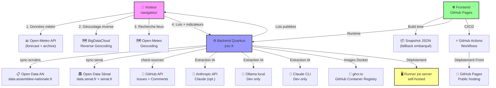

# Dépendances externes — Meteox

**Dernière mise à jour** : 2026-07-21

## Vue d'ensemble

Carte visuelle des flux de dépendances externes du projet Meteox (frontend + backend). Chaque dépendance est une décision commune (voir AGENTS.md : « Toute nouvelle dépendance externe est une décision commune »).

## Registre des dépendances

| Dépendance | Qui la contrôle | Coût | Credentials | Risque si indisponible | Remplaçabilité | Statut |
|---|---|---|---|---|---|---|
| **Open-Meteo API** (forecast + archive) | Open-Meteo (Allemagne) | Gratuit | Aucune clé | Onglet Météo inopérant ; fallback : messages « données indisponibles » | ⭐⭐⭐ Haute (Visual Crossing, Metaweather, ERA5 direct) | Approuvé 2026-01 |
| **BigDataCloud Reverse Geocoding** | BigDataCloud Ltd | Gratuit / payant au-delà 10k req/jour | Aucune clé requise | Géolocalisation textuelle échoue, affichage coords brutes `48.50, 2.35` | ⭐⭐⭐ Haute (Nominatim OSM, Google Maps Geocoding) | Approuvé 2026-01 |
| **Open-Meteo Geocoding** | Open-Meteo | Gratuit | Aucune clé | Recherche manuelle de lieux par code postal bloquée | ⭐⭐⭐ Haute (Nominatim OSM, Google Places API) | Approuvé 2026-01 |
| **API Backend meteox-laws** | Propriétaire (jrec.fr) | Auto-hébergé | Aucune (CORS public) | Onglet Lois servi par le **snapshot embarqué** (données archivées, datées honnêtement) ; plus de fraîcheur | ⭐ Basse (remplacement complet = nouveau backend) | Approuvé 2026-07-16 |
| **Open Data Assemblée Nationale** | Assemblée Nationale FR | Gratuit (open data) | Aucune | Données de votes obsolètes, sync-scrutins échoue quotidiennement | ⭐⭐ Moyenne (export manuel AN, polling alternatif) | Approuvé 2026-07 |
| **Open Data AN — AMO30** (tous acteurs, mandats, organes) | Assemblée Nationale FR | Gratuit (open data) | Aucune | Données de groupe politique / cosignataires indisponibles ; signal d'importance et analyse réseau dégradés (résolution best-effort → signataires vides, candidats conservés) | ⭐ Basse (pas d'équivalent structuré des mandats AN) | Approuvé 2026-07 (open data AN) |
| **Open Data Sénat** (Dosleg, scrutins JSON, ODSEN_HISTOGROUPES) | Sénat FR (data.senat.fr + senat.fr) | Gratuit — Licence Ouverte | Aucune | Facette « scrutin public au Sénat » des cartes obsolète ou absente ; sync-senat échoue (cache disque réutilisé, dernière valeur conservée) | ⭐ Basse (pas d'équivalent structuré des dossiers/scrutins du Sénat) | Approuvé 2026-07-21 (extension Sénat, issue #3 tâche 4) |
| **GitHub API** (issues, comments) | GitHub / Microsoft | Gratuit (public) / plan GitHub | `MX_GITHUB_TOKEN` | Job check-sources échoue, pas de rapports sur les sources invalides | ⭐⭐⭐ Haute (Mail notifier, Slack webhook, Telegram) | Approuvé (intégré CD) |
| **GitHub OAuth** (connexion admin) | GitHub / Microsoft | Gratuit | `MX_GITHUB_OAUTH_CLIENT_ID` + `_SECRET` (OAuth App) | Connexion admin GitHub indisponible ; repli sur le jeton `X-Admin-Token` de secours (l'admin reste accessible) | ⭐⭐⭐ Haute (autre IdP OAuth/OIDC, ou jeton seul) | Approuvé 2026-07-20 (demande utilisateur, remplace le jeton comme voie humaine) |
| **GitHub Container Registry** (ghcr.io) | GitHub / Microsoft | Gratuit (public) | Token GITHUB_TOKEN (CI) | Build échoue, impossible de déployer nouvelles images | ⭐⭐ Moyenne (Docker Hub, private registry, Quay.io) | Approuvé (intégré CD) |
| **Anthropic Claude API** | Anthropic | Payant (~$0.003/1k input tokens) | `MX_ANTHROPIC_API_KEY` | Extraction assistée indisponible ; aucun score publié sans relecture humaine (workflow draft), l'existant reste servi | ⭐⭐ Moyenne (Ollama fallback, CLI Claude local, Open AI) | Approuvé 2026-07 multi-backend |
| **Ollama** (LLM local) | Open source | Gratuit | Aucune (réseau local) | Dev/int seulement ; extraction IA dégradée en dev | ⭐⭐⭐⭐ Très haute (optionnel, dev only) | Optionnel (dev) |
| **Claude CLI** (extraction locale) | Anthropic | Gratuit (utilise local subscription) | Aucune clé API | Dev seulement ; perte exécution locale, nécessite API | ⭐⭐⭐ Haute (Claude API fallback, Ollama) | Optionnel (dev) |
| **Runner self-hosted** `jre-server` | Propriétaire (jrec.fr) | Auto-hébergé | Aucun (réseau privé) | **Critique** : déploiement int bloqué, backend inaccessible | ⭐ Basse (exige infra cloud alternative) | Approuvé (architecture int) |
| **GitHub Pages** | GitHub / Microsoft | Gratuit | Aucune (public) | Frontend intégralement inaccessible | ⭐⭐ Moyenne (Vercel, Netlify, S3 + CloudFront) | Approuvé (hébergement front) |
| **GitHub Actions** | GitHub / Microsoft | Gratuit (repo public) | Token GITHUB_TOKEN (ci-cd) | CI/CD échoue, déploiement bloqué | ⭐⭐ Moyenne (GitLab CI, Jenkins, CircleCI) | Approuvé (intégré repo) |

## Décisions en cours

- **Backend prod** : Actuellement l'int est déployé sur jrec.fr/meteox-laws-int. Une décision sur l'environnement prod distinct (e.g., prod.jrec.fr/meteox-laws-prod) n'est pas encore actée. À convenir avec le propriétaire.

- **Anthropic API limits** : Pas de compte entreprise actuellement. Vérifier le quota/rate-limit avant montée en charge (facturation à la consommation, env de production).

## Notes

1. **Snapshot de fallback** : Chaque build frontale valide les lois via `check:sources` (test) et génère un snapshot JSON embarqué. Le frontend charge l'API d'abord, puis bascule sur le snapshot en cas de timeout (5s) ou erreur. Cela garantit une version stable même si l'API backend est temporairement indisponible.

2. **Multi-backend IA** : Le backend Quarkus implémente une abstraction `IndicatorExtractor` avec trois implémentations :
   - `ClaudeApiExtractor` → API Anthropic (production)
   - `ClaudeCliExtractor` → CLI local (dev sur jrec.fr)
   - `OllamaExtractor` → Ollama local (dev seulement)
   
   Le choix du backend est configurable via `quarkus.laws.ai.backend` (valeur : `claude-api`, `claude-cli`, `ollama`).

3. **Runner self-hosted** : Le tag `[self-hosted, meteox]` cible un runner dédié sur le serveur jrec.fr (Docker Swarm). Ce runner exécute le déploiement `docker stack up` en int et effectue les vérifications de santé/CORS post-déploiement.

4. **Reliance matrix** :
   - Frontend ➜ Backend : **critique** (fallback via snapshot)
   - Backend ➜ Open Data AN : **élevée** (données légales, job quotidien)
   - Backend ➜ Open Data Sénat : **moyenne** (facette Sénat des cartes, job quotidien ; cache disque réutilisé si indisponible — Licence Ouverte : mentionner la source et la date de mise à jour)
   - Backend ➜ Anthropic API : **moyenne** (extraction assistée, scores=0 en fallback)
   - Pipeline CD ➜ GitHub Actions + self-hosted runner : **critique** (sans déploiement, version en production restée figée)
